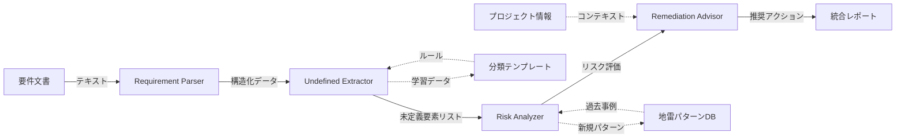

# アーキテクチャとモジュール構成

## システムアーキテクチャ

### 全体構成図

```
┌─────────────────────────────────────────────────────────────┐
│                    User Interface Layer                      │
│  (CLI / Web UI / IDE Plugin / API)                          │
└──────────────────────┬──────────────────────────────────────┘
                       │
┌──────────────────────▼──────────────────────────────────────┐
│                  Orchestration Layer                         │
│              (Analysis Coordinator)                          │
│  - ワークフロー制御                                            │
│  - モジュール間の連携                                          │
│  - 結果の統合                                                 │
└──────┬───────────┬───────────┬───────────┬──────────────────┘
       │           │           │           │
┌──────▼──────┐ ┌─▼─────────┐ ┌▼──────────┐ ┌▼───────────────┐
│  Module 1   │ │ Module 2  │ │ Module 3  │ │   Module 4     │
│ Requirement │ │ Undefined │ │   Risk    │ │  Remediation   │
│   Parser    │ │ Extractor │ │  Analyzer │ │    Advisor     │
└─────────────┘ └───────────┘ └───────────┘ └────────────────┘
       │               │              │              │
┌──────▼───────────────▼──────────────▼──────────────▼─────────┐
│                    Knowledge Base Layer                       │
│  - 分類テンプレート                                            │
│  - 地雷パターンDB                                              │
│  - 過去の分析結果                                              │
│  - ドメイン固有ルール                                          │
└───────────────────────────────────────────────────────────────┘
```

---

## モジュール詳細設計

### Module 1: Requirement Parser（要件解析モジュール）

#### 責務
自然言語で書かれた要件を構造化し、エンティティ、関係、制約を抽出する。

#### 機能
1. **テキスト前処理**
   - 文章の分割（センテンス単位、パラグラフ単位）
   - 正規化（表記ゆれの統一）
   - ノイズ除去（冗長な表現の削除）

2. **エンティティ抽出**
   - 主要概念の識別（ユーザー、商品、注文など）
   - 属性の識別（名前、価格、日時など）
   - 関係性の識別（所有、参照、依存など）

3. **意図分析**
   - 機能要件 vs 非機能要件
   - 制約 vs 目標
   - 必須 vs 任意

4. **構造化出力**
   - エンティティリスト
   - リレーションシップマップ
   - 制約条件リスト

#### 入力形式
```yaml
input:
  type: "text"
  content: "自然言語の要件文"
  metadata:
    source: "要件定義書 / 仕様書 / メール / チケット"
    author: "作成者"
    timestamp: "作成日時"
    context: "プロジェクト情報、ドメイン情報"
```

#### 出力形式
```yaml
output:
  document_id: "DOC-001"
  parsed_at: "2026-01-07T10:00:00Z"
  
  entities:
    - id: "E-001"
      name: "ユーザー"
      type: "actor"
      attributes:
        - name: "ユーザーID"
          mentioned: true
          defined: false
        - name: "名前"
          mentioned: true
          defined: false
      
    - id: "E-002"
      name: "商品"
      type: "object"
      attributes:
        - name: "商品名"
          mentioned: true
          defined: true
          definition: "文字列型"
        - name: "価格"
          mentioned: true
          defined: false
  
  relationships:
    - id: "R-001"
      from: "E-001"
      to: "E-002"
      type: "owns"
      description: "ユーザーは商品を所有する"
      cardinality: "unknown"
  
  actions:
    - id: "A-001"
      verb: "追加する"
      subject: "E-001"
      object: "E-002"
      conditions:
        - description: "在庫がある場合"
          defined: false
      constraints: []
  
  requirements:
    - id: "REQ-001"
      type: "functional"
      text: "ユーザーは商品をカートに追加できる"
      priority: "unknown"
      completeness_score: 0.3
      ambiguity_score: 0.7
```

#### 単体での利用例
```bash
# CLI
requirement-parser analyze --input requirements.txt --output parsed.json

# API
POST /api/parse
{
  "text": "ユーザーは商品をカートに追加できる"
}
```

---

### Module 2: Undefined Extractor（未定義要素抽出モジュール）

#### 責務
構造化された要件から、定義されていない要素を検出し、分類する。

#### 機能
1. **パターンマッチング**
   - 分類テンプレートに基づくルールベース検出
   - 正規表現による曖昧表現の検出
   - キーワード辞書による欠落検出

2. **意味解析**
   - 文脈からの未定義要素の推論
   - 暗黙的な前提の顕在化
   - 矛盾・不整合の検出

3. **分類**
   - 6つの主要カテゴリへの分類
   - サブカテゴリの特定
   - 横断的視点での評価

4. **質問生成**
   - 未定義要素を解消するための質問を自動生成

#### 入力形式
```yaml
input:
  parsed_requirements: "Module 1の出力"
  classification_template: "分類ルール"
  domain_knowledge: "ドメイン固有の知識（オプション）"
```

#### 出力形式
```yaml
output:
  document_id: "DOC-001"
  analyzed_at: "2026-01-07T10:05:00Z"
  
  undefined_elements:
    - id: "UE-001"
      category: "データ定義の欠落"
      subcategory: "制約条件"
      entity: "E-002"
      attribute: "価格"
      
      description: "価格の範囲が定義されていない"
      
      questions:
        - "価格の最小値は？（0円？1円？）"
        - "価格の最大値は？"
        - "小数点は許可するか？"
        - "通貨単位は？（円？ドル？）"
      
      detection_method: "pattern_matching"
      confidence: 0.9
      
      context:
        source_text: "商品の価格"
        surrounding_text: "商品名と価格を表示する"
        line_number: 15
      
      cross_references:
        - "UE-005"  # 通貨表示の未定義と関連
    
    - id: "UE-002"
      category: "振る舞いの曖昧さ"
      subcategory: "実行条件"
      action: "A-001"
      
      description: "在庫確認のタイミングが不明"
      
      questions:
        - "在庫チェックはリアルタイムか？"
        - "他ユーザーの同時購入をどう扱うか？"
        - "在庫予約の仕組みは必要か？"
      
      detection_method: "semantic_analysis"
      confidence: 0.85
      
      context:
        source_text: "在庫がある場合"
        surrounding_text: "在庫がある場合のみ追加可能"
        line_number: 22
  
  statistics:
    total_undefined: 15
    by_category:
      data_definition: 5
      behavior_ambiguity: 4
      responsibility_gap: 2
      boundary_condition: 2
      error_handling: 1
      non_functional: 1
    
    by_confidence:
      high: 8
      medium: 5
      low: 2
```

#### 単体での利用例
```bash
# CLI
undefined-extractor analyze --input parsed.json --template classification.yaml

# API
POST /api/extract-undefined
{
  "parsed_requirements": {...},
  "options": {
    "confidence_threshold": 0.7,
    "categories": ["data_definition", "behavior_ambiguity"]
  }
}
```

---

### Module 3: Risk Analyzer（地雷推論モジュール）

#### 責務
未定義要素が引き起こす潜在的な問題（地雷）を予測し、リスク評価を行う。

#### 機能
1. **地雷パターンマッチング**
   - 過去の失敗事例DBとの照合
   - 典型的な問題パターンの検索
   - ドメイン固有のリスクパターン適用

2. **影響分析**
   - 発生確率の推定
   - 影響範囲の特定
   - 連鎖的影響の予測

3. **リスクスコアリング**
   - 4軸評価（確率、影響度、発見困難度、修正コスト）
   - 総合リスクレベルの算出
   - 優先順位付け

4. **シナリオ生成**
   - 具体的な問題発生シナリオの記述
   - ステークホルダーへの影響の説明

#### 入力形式
```yaml
input:
  undefined_elements: "Module 2の出力"
  risk_knowledge_base: "地雷パターンDB"
  project_context:
    phase: "要件定義 / 設計 / 実装"
    team_size: 5
    deadline: "2026-03-31"
    domain: "ecommerce"
```

#### 出力形式
```yaml
output:
  document_id: "DOC-001"
  analyzed_at: "2026-01-07T10:10:00Z"
  
  risks:
    - id: "RISK-001"
      undefined_element: "UE-002"
      
      title: "在庫の同時実行制御不備による在庫マイナス"
      
      scenario: |
        1. ユーザーAとユーザーBが同時に在庫1の商品をカート追加
        2. 両方とも在庫チェックを通過
        3. 両方が購入を確定
        4. 在庫が-1になる
        5. 出荷不可能な注文が発生
      
      consequences:
        - type: "business"
          description: "顧客への謝罪と返金対応"
          cost: "中"
        - type: "reputation"
          description: "SNSでの炎上リスク"
          cost: "高"
        - type: "technical"
          description: "緊急の修正パッチリリース"
          cost: "高"
      
      risk_assessment:
        probability: "high"
        probability_score: 4
        probability_reasoning: "同時アクセスが多いECサイトでは高頻度で発生"
        
        impact: "medium"
        impact_score: 3
        impact_reasoning: "一部の注文に影響、システム停止には至らない"
        
        detectability: "high"
        detectability_score: 4
        detectability_reasoning: "本番環境の負荷テストまで発見困難"
        
        remediation_cost: "high"
        remediation_cost_score: 4
        remediation_cost_reasoning: "トランザクション設計の見直しが必要"
        
        total_score: 3.7
        level: "最高危険度"
      
      similar_incidents:
        - case_id: "CASE-123"
          project: "某ECサイトリニューアル"
          description: "在庫管理の不備で1000件の過剰注文"
          cost: "500万円の損失"
      
      prevention_cost:
        if_found_in_requirement: "1日"
        if_found_in_design: "3日"
        if_found_in_implementation: "1週間"
        if_found_in_production: "1ヶ月+損失額"
    
    - id: "RISK-002"
      undefined_element: "UE-001"
      
      title: "価格の小数点扱いの不明確さによる金額計算ミス"
      
      scenario: |
        1. 価格を小数点付きで入力可能な実装
        2. 消費税計算で丸め誤差が発生
        3. 決済金額とDB上の金額が一致しない
        4. 会計監査で指摘される
      
      risk_assessment:
        probability: "medium"
        probability_score: 2
        impact: "medium"
        impact_score: 3
        detectability: "medium"
        detectability_score: 2
        remediation_cost: "medium"
        remediation_cost_score: 3
        total_score: 2.6
        level: "高危険度"
  
  summary:
    total_risks: 15
    critical: 2
    high: 5
    medium: 6
    low: 2
    
    estimated_total_cost_if_ignored: "2000万円〜5000万円"
    estimated_prevention_cost: "2週間の追加作業"
```

#### 単体での利用例
```bash
# CLI
risk-analyzer analyze --input undefined.json --knowledge-base risks.db

# API
POST /api/analyze-risk
{
  "undefined_elements": [...],
  "project_context": {...}
}
```

---

### Module 4: Remediation Advisor（修正指示生成モジュール）

#### 責務
検出された未定義要素に対して、どの工程で誰が何をすべきかを提案する。

#### 機能
1. **工程判定**
   - 要件定義、設計、実装、テストのどこで解消すべきか判定
   - 現在の工程と推奨工程のギャップ分析

2. **アクション生成**
   - 具体的な解消アクションの提案
   - 必要な情報と確認先の明示
   - ドキュメント更新箇所の特定

3. **優先順位付け**
   - リスクレベルと工程を考慮した優先順位
   - クイックウィン（短時間で解消可能）の特定

4. **トラッキング**
   - 未定義要素の受容/解消の記録
   - 決定の理由と責任者の記録

#### 入力形式
```yaml
input:
  risks: "Module 3の出力"
  project_status:
    current_phase: "設計"
    team_members:
      - role: "PM"
        name: "山田太郎"
      - role: "architect"
        name: "佐藤花子"
    constraints:
      budget: "限定的"
      deadline: "タイト"
```

#### 出力形式
```yaml
output:
  document_id: "DOC-001"
  generated_at: "2026-01-07T10:15:00Z"
  
  recommendations:
    - id: "REC-001"
      undefined_element: "UE-002"
      risk: "RISK-001"
      priority: 1
      
      recommended_phase: "design"
      current_phase: "design"
      urgency: "immediate"
      
      action:
        type: "clarify"
        title: "在庫管理の同時実行制御を設計で明確化"
        
        steps:
          - step: 1
            description: "トランザクション分離レベルを決定"
            assignee: "architect"
            estimated_time: "2時間"
            
          - step: 2
            description: "楽観的ロック vs 悲観的ロックを選択"
            assignee: "architect"
            estimated_time: "1時間"
            decision_criteria:
              - "同時アクセスの頻度"
              - "データベースの性能特性"
            
          - step: 3
            description: "在庫予約テーブルの設計"
            assignee: "architect"
            estimated_time: "4時間"
            
          - step: 4
            description: "ビジネス側と在庫不足時のUXを確認"
            assignee: "PM"
            estimated_time: "1時間"
            stakeholders: ["プロダクトオーナー", "CS担当"]
        
        deliverables:
          - "トランザクション設計書"
          - "在庫管理のシーケンス図"
          - "エラーハンドリング仕様"
        
        acceptance_criteria:
          - "同時購入のシナリオで在庫マイナスが発生しない"
          - "パフォーマンステストで目標値をクリア"
      
      alternatives:
        - option: "accept_risk"
          description: "リスクを受容し、発生時の対応手順を用意"
          conditions: "予算・時間が極端に制限されている場合"
          residual_risk: "high"
        
        - option: "defer"
          description: "MVP版では単純な実装、v2で改善"
          conditions: "初期のユーザー数が少ない場合"
          residual_risk: "medium"
    
    - id: "REC-002"
      undefined_element: "UE-001"
      risk: "RISK-002"
      priority: 2
      
      recommended_phase: "requirement_definition"
      current_phase: "design"
      urgency: "high"
      warning: "現在の工程より前の工程に戻る必要があります"
      
      action:
        type: "rollback_and_clarify"
        title: "価格のデータ仕様を要件定義で明確化"
        
        steps:
          - step: 1
            description: "会計担当と金額の扱いを確認"
            assignee: "PM"
            estimated_time: "1時間"
            questions:
              - "小数点以下は扱うか？"
              - "消費税の丸め方は？"
              - "通貨は円のみか？"
          
          - step: 2
            description: "要件定義書に追記"
            assignee: "PM"
            estimated_time: "30分"
          
          - step: 3
            description: "設計書を見直し"
            assignee: "architect"
            estimated_time: "2時間"
        
        impact_on_schedule: "+1日"
  
  summary:
    total_recommendations: 15
    by_phase:
      requirement_definition: 3
      design: 7
      implementation: 4
      testing: 1
    
    by_urgency:
      immediate: 2
      high: 5
      medium: 6
      low: 2
    
    estimated_total_effort: "5人日"
    
    quick_wins:
      - id: "REC-010"
        description: "エラーメッセージの文言を実装で決定"
        effort: "30分"
        risk_reduction: "medium"
  
  tracking:
    decisions:
      - undefined_element: "UE-015"
        decision: "accepted"
        reason: "MVP版では対応せず、v2で実装"
        decided_by: "PM"
        decided_at: "2026-01-07T09:00:00Z"
        residual_risk: "low"
```

#### 単体での利用例
```bash
# CLI
remediation-advisor generate --input risks.json --project-status status.yaml

# API
POST /api/generate-recommendations
{
  "risks": [...],
  "project_status": {...}
}
```

---

## Orchestration Layer（統合レイヤー）

### Analysis Coordinator

#### 責務
4つのモジュールを統合し、エンドツーエンドの分析ワークフローを制御する。

#### 機能
```yaml
workflows:
  full_analysis:
    steps:
      - module: "requirement_parser"
        input: "user_input"
        output: "parsed_requirements"
      
      - module: "undefined_extractor"
        input: "parsed_requirements"
        output: "undefined_elements"
      
      - module: "risk_analyzer"
        input: "undefined_elements"
        output: "risks"
      
      - module: "remediation_advisor"
        input: "risks"
        output: "recommendations"
    
    result:
      type: "comprehensive_report"
      format: ["json", "markdown", "html", "pdf"]
  
  quick_check:
    steps:
      - module: "requirement_parser"
      - module: "undefined_extractor"
    
    result:
      type: "undefined_elements_list"
  
  risk_only:
    steps:
      - module: "risk_analyzer"
        input: "pre_extracted_undefined_elements"
    
    result:
      type: "risk_report"
```

#### インターフェース
```bash
# フルワークフロー
usd-cli analyze --input requirements.txt --output report.md

# 特定モジュールのみ
usd-cli parse --input requirements.txt
usd-cli extract --input parsed.json
usd-cli assess-risk --input undefined.json
usd-cli recommend --input risks.json

# インタラクティブモード
usd-cli interactive
```

---

## Knowledge Base Layer（知識ベース層）

### 構成要素

1. **分類テンプレート**
   - `classification-template.yaml`
   - カテゴリ定義、検出ルール、質問テンプレート

2. **地雷パターンDB**
   - `risk-patterns.db`
   - 過去の失敗事例、典型的な問題パターン、対処法

3. **ドメイン知識**
   - `domains/ecommerce.yaml`
   - `domains/financial.yaml`
   - ドメイン固有の制約、ビジネスルール、リスクパターン

4. **分析履歴**
   - `history/project-xxx/analysis-yyy.json`
   - 過去の分析結果、決定履歴、学習データ

### 拡張性
```yaml
# カスタムドメイン知識の追加
domains:
  custom_domain:
    name: "医療システム"
    specific_risks:
      - category: "法規制"
        patterns:
          - "個人情報の扱いが不明確"
          - "医療機器プログラムの該当性が未確認"
    
    mandatory_requirements:
      - "患者同意の取得方法"
      - "監査ログの保存期間"
```

---

## 非機能要件

### パフォーマンス
- 1000行の要件文書を5分以内に分析
- 100個の未定義要素に対するリスク評価を1分以内

### スケーラビリティ
- モジュール単位での並列処理
- 大規模文書のチャンク分割処理

### 保守性
- モジュール間の疎結合
- 明確なインターフェース定義
- バージョニング戦略

### テスト戦略
```yaml
test_types:
  unit_test:
    - 各モジュールの単体動作
    - エッジケースの処理
  
  integration_test:
    - モジュール間のデータ連携
    - ワークフロー全体の動作
  
  validation_test:
    - 前提の破綻検出（完全な仕様で未定義要素が出ないか）
    - 意図的に欠陥のある仕様で正しく検出できるか
    - 過去の失敗事例で正しく警告できるか
  
  regression_test:
    - 既知の分析結果の再現性
    - 改善による予期しない動作変更の検出
```

---

## デプロイメント構成

### オプション1: スタンドアロン CLI
```bash
pip install undefined-spec-detector
usd-cli analyze --input requirements.txt
```

### オプション2: Web UI
```bash
docker-compose up
# http://localhost:3000 でアクセス
```

### オプション3: IDEプラグイン
```
VS Code / IntelliJ IDEA プラグイン
- リアルタイム分析
- インライン警告表示
```

### オプション4: CI/CD統合
```yaml
# .github/workflows/spec-check.yml
- name: Check Specification
  run: usd-ci --input docs/requirements.md --fail-on high
```

---

## モジュール間のデータフロー



---

## まとめ

このアーキテクチャは以下の原則に基づいています：

1. **モジュラー設計**: 各モジュールは独立して動作可能
2. **単一責任の原則**: 各モジュールは明確な単一の責務を持つ
3. **拡張性**: 新しいドメイン知識やルールを容易に追加可能
4. **実用性**: CLI、Web UI、IDE統合など複数の利用形態をサポート
5. **継続的改善**: 分析結果を知識ベースにフィードバック


